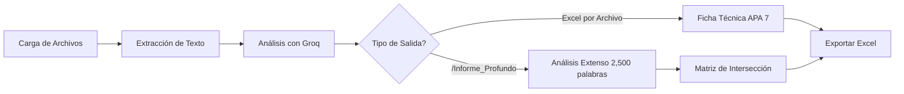

# 🌊 Auditor de Seguridad Ambiental: Cuenca de Tula
## Sistema de Análisis Normativo y Académico

Aplicación especializada para analizar papers académicos, normativa ambiental y documentos técnicos por lotes (5-10 archivos), generando fichas técnicas en **APA 7.ª edición** y exportando análisis completos a Excel.

---

## 📋 Características Principales

✅ **Análisis de Documentos**: Procesa PDF, DOCX y TXT  
✅ **Referenciación APA 7**: Generación automática de fichas técnicas  
✅ **Cola de Procesamiento**: BullMQ + Redis para análisis concurrentes  
✅ **Exportación Excel**: Resultados compilados en hojas especializadas  
✅ **IA-Powered**: Análisis con Groq LLM (llama-3.3-70b)  
✅ **Informe Profundo**: Dictamen técnico de 2,500 palabras con `/Informe_Profundo`  

---

## 🏗️ Estructura

```
├── backend/                # API Node.js + BullMQ + Redis
│   ├── index.js           # Servidor principal y worker
│   ├── package.json       # Dependencias
│   └── uploads/           # Archivos temporales
├── frontend/              # React + Vite
│   ├── src/
│   │   ├── App.jsx        # Interfaz principal
│   │   ├── main.jsx       # Entry point
│   │   └── index.html     # HTML base
│   ├── package.json       # Dependencias
│   └── vite.config.js     # Configuración Vite
├── SYSTEM_PROMPT.md       # Instrucciones de análisis
├── WELCOME_MESSAGE.md     # Mensaje de bienvenida
└── render.yaml            # Configuración Render.com
```

---

## 🚀 Instalación Local

### Requisitos Previos

- **Node.js** 16+ 
- **Redis** 6+ (local o servicio remoto)
- **Groq API Key** ([obtener aquí](https://console.groq.com))

### Paso 1: Backend Setup

```bash
cd backend
npm install

# Crear archivo .env
cat > .env << EOF
PORT=4000
REDIS_URL=redis://127.0.0.1:6379
GROQ_API_KEY=tu_api_key_aqui
EOF

# Ejecutar en desarrollo
npm run dev
```

### Paso 2: Frontend Setup

```bash
cd frontend
npm install

# Crear archivo .env.local (opcional, si usas otra URL de backend)
cat > .env.local << EOF
VITE_API_URL=http://localhost:4000
EOF

# Ejecutar en desarrollo
npm run dev
```

### Paso 3: Verificar Funcionamiento

```bash
# Health check del backend
curl http://localhost:4000/api/health

# Interfaz frontend
# Abre http://localhost:5173 en tu navegador
```

---

## ⚙️ Variables de Entorno

### Backend

| Variable | Requerido | Default | Notas |
|----------|----------|---------|-------|
| `PORT` | No | 4000 | Puerto del servidor |
| `REDIS_URL` | **Sí** | - | `redis://host:puerto` |
| `GROQ_API_KEY` | **Sí** | - | Clave de Groq Console |

### Frontend

| Variable | Requerido | Default |
|----------|----------|---------|
| `VITE_API_URL` | No | http://localhost:4000 |

**Ver [.env.example](.env.example) para más detalles.**

---

## 📖 Uso de la Aplicación

### 1. Carga de Archivos
- Sube hasta 5 documentos (PDF, DOCX, TXT)
- El sistema extrae el título automáticamente
- Se genera referencia APA 7 formal

### 2. Seguimiento de Estado
- Visualiza el estado: ⏳ En espera → 🔄 Procesando → ✅ Completado

### 3. Exportación Básica (por documento)
- Haz click en **"⬇ Exportar"** cuando esté completado
- Se descarga un archivo `.xlsx` con:
  - **Metadata**: Título, autores, año, revista, palabras clave
  - **Análisis**: Resumen, objetivo, metodología, hallazgos, conclusiones
  - **Referencias**: Lista de obras citadas

### 4. Informe Profundo (Análisis Extenso)
Escribe en el chat:
```
/Informe_Profundo
```

Esto genera:
- **Análisis de 2,500 palabras** estructurado en 5 ejes
- **Matriz de Intersección** comparando todos los documentos
- Recomendaciones técnicas para la Cuenca de Tula

---

## 📊 Flujo de Análisis



---

## ⚡ Comandos Especiales

| Comando | Requerido | Efecto |
|---------|-----------|--------|
| `/Informe_Profundo` | ✅ | Genera análisis extenso + matriz |
| `/Limpiar` | No | Borra todos los jobs completados |

---

## 🔒 Seguridad y Restricciones

⚠️ **Importante:**

- ❌ **NO se usa información externa** a los documentos cargados
- ❌ **NO se inventan datos** faltantes
- ✅ **TODO está trazable** al texto fuente
- ✅ **Se reportan vacíos explícitamente**: "Información no disponible en la fuente analizada"

---

## 📦 Stack Técnico

### Backend
- **Express.js** - Framework web
- **BullMQ** - Cola de trabajos
- **Redis** - Cache y almacenamiento de cola
- **Groq SDK** - API de análisis con IA
- **pdf-parse** - Extracción de PDF
- **mammoth** - Extracción de DOCX
- **xlsx** - Generación de Excel
- **Multer** - Gestión de uploads

### Frontend
- **React 18** - UI Framework
- **Vite** - Build tool
- **Axios** - Client HTTP

### DevOps
- **Nodemon** - Auto-reload backend
- **Render.com** - Deployment

---

## 🌐 Despliegue a Render.com

1. Sube el repositorio a GitHub (con `.gitignore` configurado)
2. Crea servicios en Render:
   - **Backend Service**: `npm run start`
   - **Frontend Service**: `npm run build && npm run preview`
   - **Redis**: Usar add-on de Redis de Render
3. Configura variables de entorno en cada servicio
4. Ver `render.yaml` para configuración automática

---

## 🐛 Troubleshooting

### Error: "REDIS_URL no está configurada"
```bash
# Asegúrate de que Redis esté corriendo
redis-cli ping  # Debe responder: PONG
```

### Error: "GROQ_API_KEY inválida"
```bash
# Verifica tu clave en https://console.groq.com
# Cópiala correctamente en el .env
```

### No llegan respuestas del backend
```bash
# Verifica que el backend esté corriendo
curl http://localhost:4000/api/health

# Revisa CORS en el backend (está habilitado)
# Verifica VITE_API_URL en frontend
```

---

## 📝 Protocolo de Análisis

Toda salida se rige por:

1. **Identificación formal** según APA 7 (con autoría corporativa si aplica)
2. **Extracción de texto** multi-formato (PDF, DOCX, TXT)
3. **Análisis con IA** centrado en Seguridad Ambiental y Hídrica
4. **Estructura obligatoria** (Arquitectura, Rigor Metodológico, Ejes Temáticos, Seguridad Hídrica, Dictamen)
5. **Matriz de Intersección** para documentos múltiples

**Ver [SYSTEM_PROMPT.md](SYSTEM_PROMPT.md) para detalles completos.**

---

## 👨‍💼 Contacto y Atribución

- **Desarrollador**: Dr. Mario A. Ramírez Barajas
- **Solicitante**: Mtro. Pedro Santiago Sánchez
- **Especialidad**: Auditoría Ambiental, Cuenca de Tula
- **Año**: 2026

---

## 📄 Licencia

Uso interno. Contactar al desarrollador para más información.

---

## 🔗 Recursos Rápidos

- [Groq Console](https://console.groq.com) - Obtener API Key
- [Redis Docs](https://redis.io/docs/) - Redis documentation
- [Express Guide](https://expressjs.com/) - Framework backend
- [APA 7 Format](https://apastyle.apa.org/) - Estándar de referenciación
